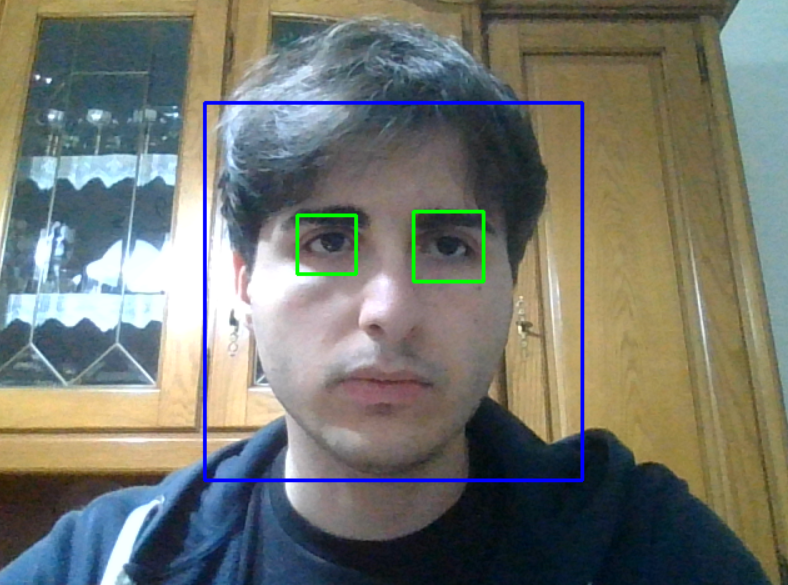

# Face & Eye Detection using OpenCV

A simple Python implementation of real-time face and eye detection using the OpenCV library. This project utilizes pre-trained Haar Cascade classifiers to identify faces and subsequently locate eyes within the detected Face Region of Interest (ROI).

## Features

- Real-time face detection.
- Eye detection nested within the face region for higher accuracy.
- Live video processing via webcam.
- Lightweight and efficient implementation using Haar Cascades.

## Prerequisites

Ensure you have Python 3.x installed. You will need the following libraries:

- `opencv-python`
- `numpy`

